#### These procedure steps will be followed on the simulator

1. Click on slump test, following window will open. 
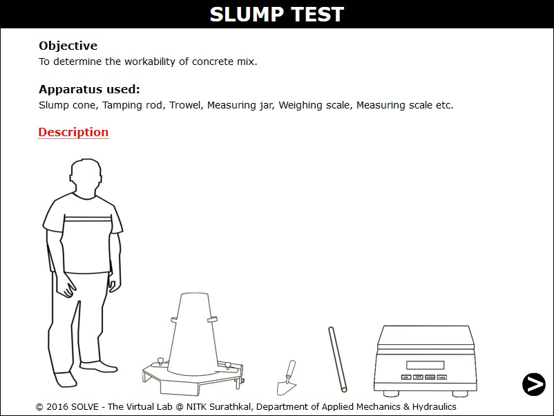 

2. Click on description to recall basic definitions. Click NEXT button which is at the bottom right corner to proceed. 
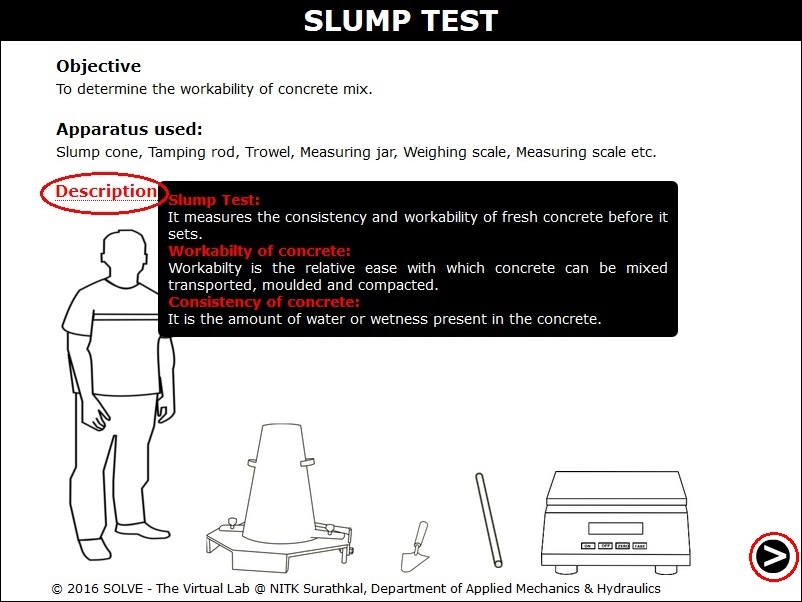 

3. Calculation of volume of slump cone is given here. Enter the calculated value and click on CHECK to verify the answer.  
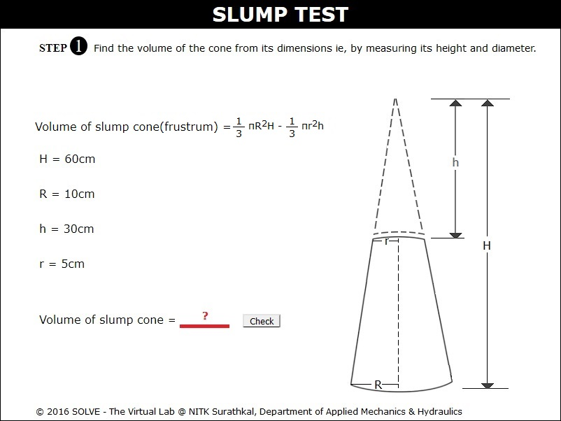 

4. Select answer to the questions to continue the experiment and then click NEXT button. 
 

5. Calculate and enter the quantity of material, then click "Check" to verify the answer and "Result" to view the correct answer. 
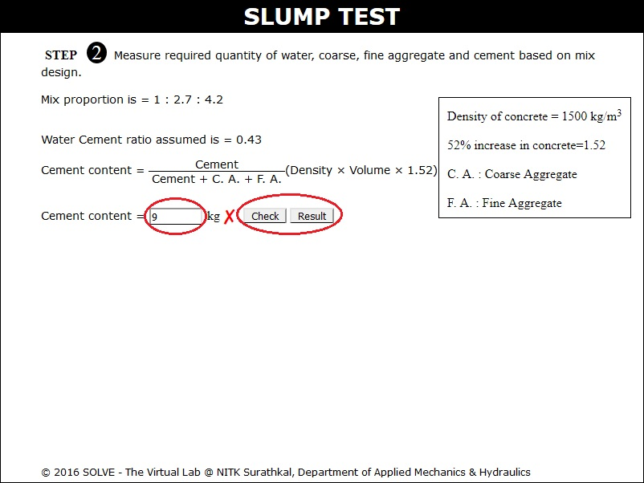 

6. Click on ON button and place the tray on the weighing balance. 
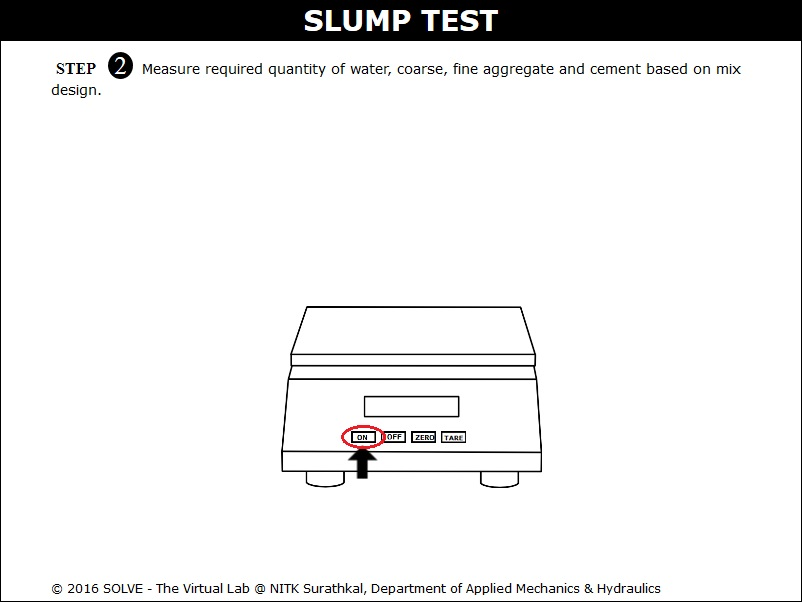 

7. Click on tray then on TARE and again on material to weigh it. 
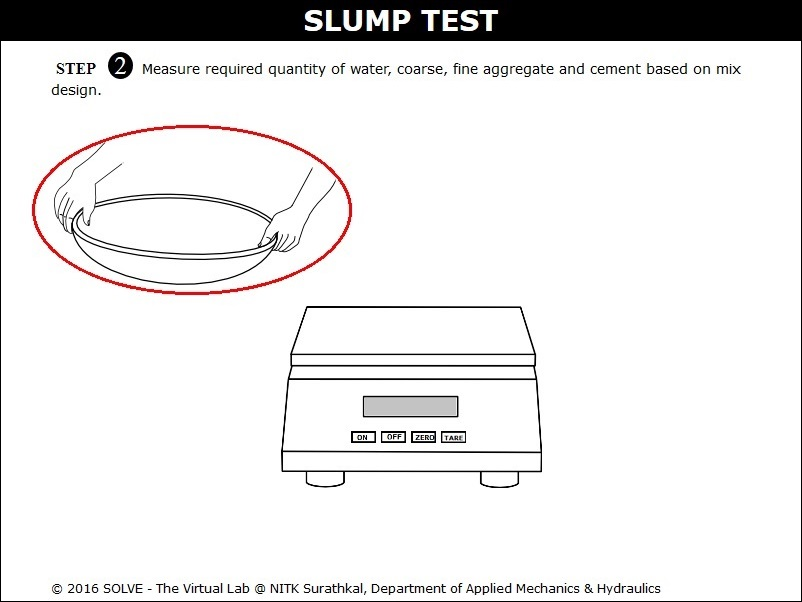 

8. Click on tray with weighed quantity of materials to mix it properly. 
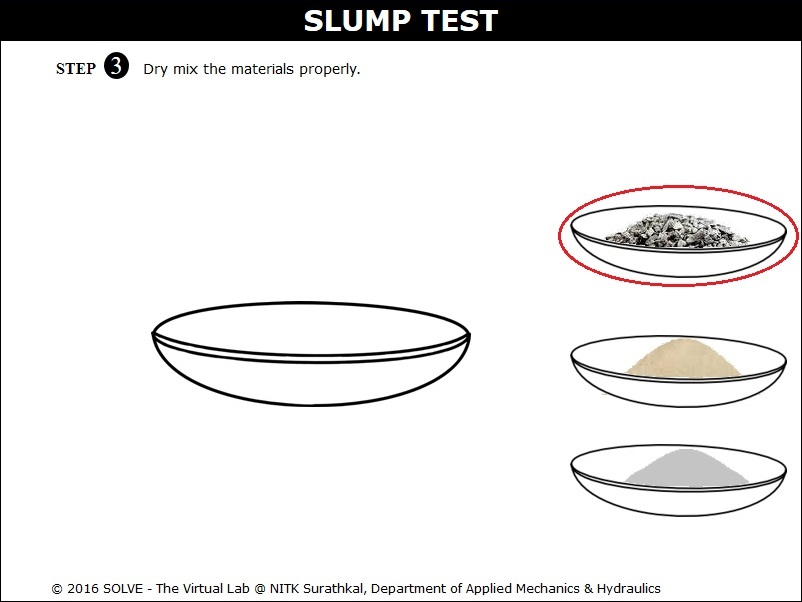 

9. Click on beaker to add measured quantity of water into the mixture and click on trowel to mix it properly. 
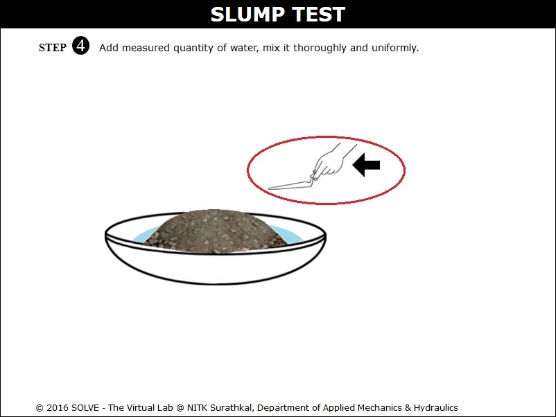 

10. Click on slump mould to place it in slump base, then on mixed concrete material to add it into the mould. Click on tamping rod to tamp it properly, repeat the same steps and then click NEXT button. 
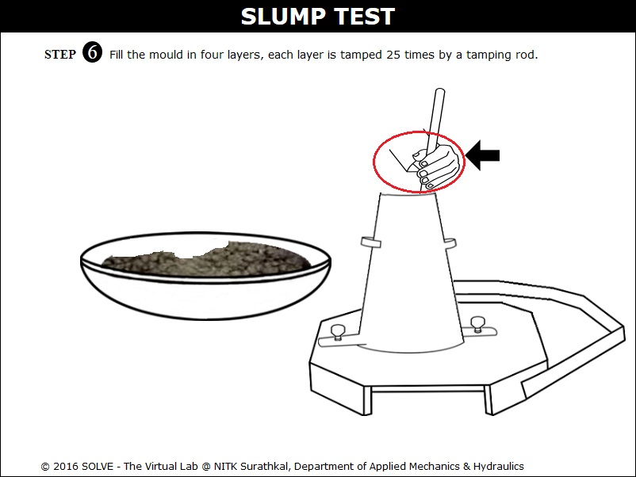 

11. Click on tamping rod to level the top surface of concrete then click NEXT button. 
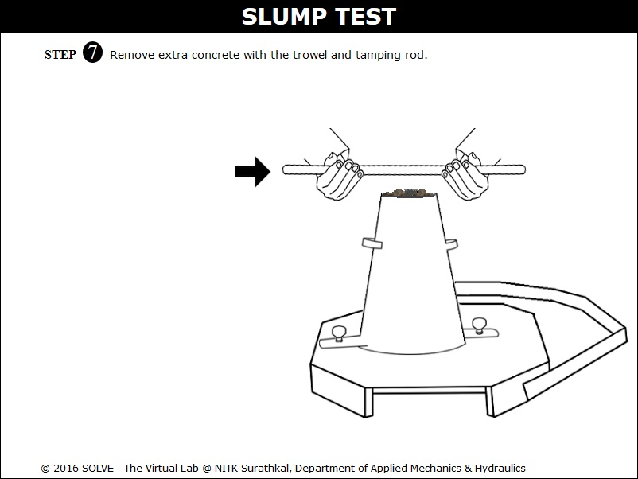 

12. Click on the connecting pin to loosen the slump cone, click on slump cone to remove it. 
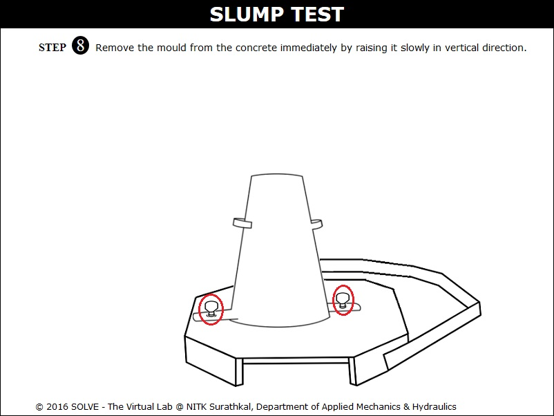 

13. Click on tamping rod to place it above the slump mould then click on scale to measure the slump value, click NEXT button to view the observations. 
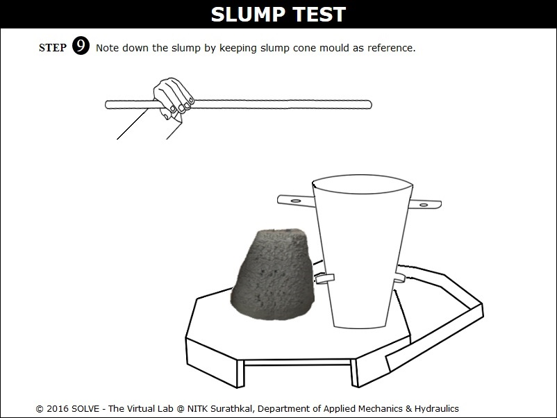 

14. Detailed observation is given here. 
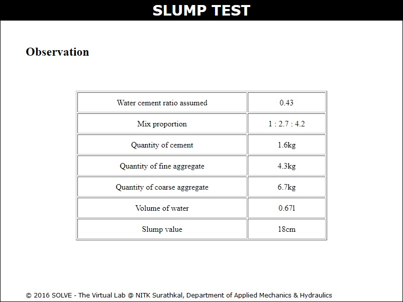 
