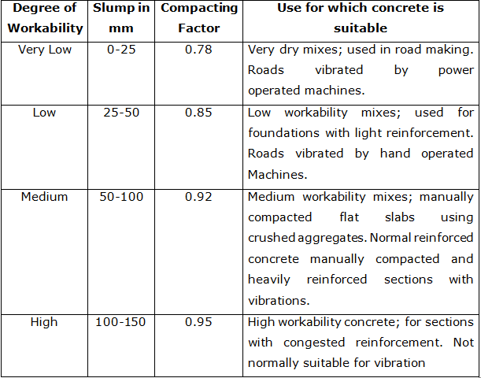
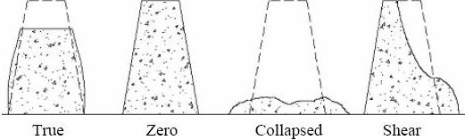

### INTRODUCTION 

The slump test indicates the behaviour of a compacted concrete cone under the action of gravitational forces. The slump test is a practical means of measuring the workability i.e., consistency of concrete, where the nominal maximum size of the aggregate does not exceed 38mm. Changes in the value of slump obtained during a job may indicate changes in materials, in the water content or in the proportions of the mix, so it is useful in controlling the quality of the concrete produced.

The application of slump test is:

1. Used to ensure uniformity for different batches of similar concrete under field conditions and to ascertain the effects of plasticizers on their introduction.

2. This test is very useful on site as a check on the day-to-day or hour- to-hour variation in the materials being fed into the mixer.

3. Too high or too low a slump gives immediate warning and enables the mixer operator to remedy the situation.

The slump test is suitable for slumps of medium to high workability, slump in the range of 5 – 260mm. The test fails to determine the difference in workability in stiff mixes which have zero slump, or for wet mixes that give a collapse slump. It is limited to concrete formed of aggregates of less than 38mm.

</img> 
Recommended Values of Slump for Different Applications 

( Source:http://www.aboutcivil.org/concrete-slump-test.html )

 

</img> 
Different Shapes of Slump 

( Source: http://www.studycivil.com/slumptestfortheworkibilityofconcrete/ )

 

<li style="text-align:justify;"><b>True Slump :</b> True slump is the only slump that can be measured in the test. The measurement is taken between the top of the cone and the top of the concrete after the cone has been removed.</li>
<li style="text-align:justify;"><b>Zero Slump :</b> Zero slump is the indication of very low water-cement ratio, which results in dry mixes. These type of concrete is generally used for road construction.</li>
<li style="text-align:justify;"><b>Collapsed Slump :</b>  This is an indication that the water-cement ratio is too high, i.e. concrete mix is too wet or it is a high workability mix, for which a slump test is not appropriate.</li>
<li style="text-align:justify;"><b>Shear Slump :</b> The shear slump indicates that the result is incomplete, and concrete to be retested.</li>

#### Relevant Indian Standard for Slump Test:
1. IS 1199 (1959): Methods of Sampling and Analysis of Concrete, Reaffirmed 2004.
 
